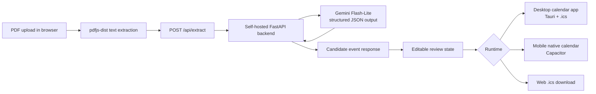

# Architecture

## System flow

## Frontend

The Vite + React application accepts a PDF through the uploader. `pdfjs-dist` extracts text in the browser, page by page. The extraction hook sends the resulting text to the backend and normalizes its snake_case event response into the review UI's `{ id, title, location, start, end }` event shape. It retains a source-text date check to avoid staging dates that do not occur in the document.

`EventList` and `EventCard` use that state as the source of truth. Users can edit titles and locations or remove events before export. Framer Motion animations use only opacity and vertical translation.

`exportLogic.js` keeps platform routing out of the UI: Tauri writes and opens a multi-event `.ics` file; Capacitor opens native event prompts sequentially; the web fallback downloads one `.ics` file.

## Backend

The backend is a single-purpose FastAPI proxy with `POST /api/extract` and `GET /health`. It has no user accounts, persistence, or database. Each request is a stateless pass-through from extracted text to Gemini and back.

CORS currently allows every origin. This is a deliberate early-stage tradeoff: the service stores no user data and has no authentication, so an origin restriction adds limited protection by itself. Revisit it together with authentication, rate limiting, and tenant boundaries before exposing a shared service.

## Model layer

The backend creates one `google-genai` client and calls `gemini-3.1-flash-lite`. Its structured-output configuration requests an array with these fields:

| Field | Meaning |
| --- | --- |
| `title` | Synthesized event title |
| `location` | Location, if confirmed |
| `start_date` | Confirmed ISO 8601 date |
| `end_date` | Confirmed ISO 8601 end date, if applicable |
| `confidence` | `high` or `low` |

Flash-Lite keeps extraction fast and inexpensive, while structured output avoids treating prose as JSON. The prompt prohibits invented dates, prefers explicit labels and table headers, groups clear start/end ranges, and chooses the earliest actionable deadline from a fee-tier table.

## Why this architecture changed

The initial hackathon pipeline ran entirely in the browser: first with a small extractive model and then with a larger local generative model. Testing against real documents exposed fabricated dates, missed titles, and difficult grouping cases. Packaging the local model also proved unreliable in the available time: model assets were missing, then ONNX Runtime Web attempted to load its WASM runtime from a CDN.

The project therefore moved to a self-hosted FastAPI proxy backed by Gemini. This is a different privacy model: extracted PDF text now leaves the device, passes through the self-hosted backend, and is sent to Google's Gemini API. The PDF file itself is not uploaded by the current frontend; only text produced by `pdfjs-dist` is posted to `/api/extract`. The Gemini API key stays only in `server/.env` and is never sent to the browser.

## Deployment

One machine runs FastAPI on `:5014` and the Vite development server on `:5015`. The reverse proxy terminates TLS and routes `schedge.gokulp.online` to `:5015` and `schedgeb.gokulp.online` to `:5014`.

Vite is configured with `allowedHosts: ['schedge.gokulp.online']`; a deployment must preserve the original `Host` header for this to work. The proxy must also pass WebSocket upgrade headers to `:5015`, otherwise Vite HMR cannot connect. These are operational requirements of the development-server deployment, not application routing rules.

## Open product decision

The product still needs a documented policy for documents containing several related dates. The current prompt handles obvious ranges and fee tiers, but the intended behavior for all deadline sets, reminders, and multi-part schedules has not been finalized.
